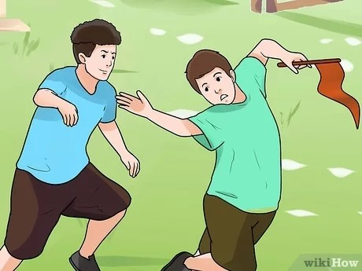

Capture the Flag!
=================
## Main Concept
_________________



깃발을 가진 유저가 총알을 맞아 죽으면 깃발을 떨어뜨린다.
상대방 깃발을 뺏어 상대 리스폰 지역 체크포인트에 가져다 넣으면 득점한다.

## Physics Engine
_____________________

RigidBody의 사용을 최소화하고 중력, 마찰력, 수직항력, 충돌 처리등을 직접 구현하여 사용하였다. 


### 1. impulse
```cs
public void Setimpulse(Vector3 inputimpulse)
    {
        impulse = inputimpulse;
    }

    public void Impulseprocessing()
    {
        if (impulse.magnitude != 0)
        {
            var addvelocity = impulse / mass;
            velocity += addvelocity;
            impulse = new Vector3(0, 0, 0);
        }
    }
```
충격량 / 질량만큼 속도를 증가시킨 뒤 충격량을 초기화한다. 


### 2. normal force

```cs
    Vector3 Getnormalforce()
    {
        if (isGrounded)
        {
            RaycastHit hit;

            if (Physics.Raycast(transform.position, transform.TransformDirection(Vector3.down), out hit, Mathf.Infinity))
            {
                var hitnormal = hit.normal;
                Vector3 normalforce = mass * gravityparameter * hitnormal * Getcos(hitnormal, new Vector3(0, 1, 0));
                return normalforce;
            }

            else
            {
                return new Vector3(0, 0, 0);
            }
        }
        else
        {
            return new Vector3(0, 0, 0);
        }
    }
```
if Raycast로 바닥면이 검출된다면: 
수직항력 = 질량 * 중력 가속도 * 바닥면의 법선 벡터 * Get cosine (법선벡터와 Vector.up의 관계)

else 검출되지 않는다면: 수직 항력은 0

### 3. gravity force

```cs
    Vector3 Getgravityforce()
    {
        Vector3 gravityforce = new Vector3(0, -Mathf.Abs(mass * gravityparameter), 0);
        return gravityforce;
    }
```
중력힘 = 중력 가속도 * 질량, 아래로 작용하므로 절대값의 음수로 적용


### 4. friction force

```cs    
Vector3 Getfrictionforce()
    {
        if (velocity.magnitude > 0.05f && isGrounded == true)
        {

            Vector3 frictionforce = -1f * Getnormalforce().magnitude * movefrictionparameter * velocity.normalized;

            return frictionforce;
        }
        else
        {
            return new Vector3(0, 0, 0);
        }
    }
```
if 속도가 일정 이상이고 바닥에 닿아있을 경우:

마찰력 = 수직항력의 크기 * 마찰계수 * 속도의 방향, 속도와 반대방향으로 작용하므로 음수로 적용


### 5. friction direction

```cs
   Vector3 Getfrictiondirectionvector()
    {
        RaycastHit hit;
        if (Physics.Raycast(transform.position, transform.TransformDirection(Vector3.down), out hit, Mathf.Infinity))
        {
            var hitnormal = hit.normal;
            Vector3 normalforce = gravityparameter * hitnormal * Getcos(hitnormal, new Vector3(0, -1, 0));
            var gravitydirectionvector = new Vector3(0, -1, 0);
            var planenormalvector = hit.normal.normalized;
            var crossvector = Getcrossvector(gravitydirectionvector, planenormalvector);
```
수직항력, 중력의 방향 벡터, 바닥의 법선 벡터를 구한 뒤,

중력 방향 벡터와 바닥 법선 벡터의 외적을 정규화하여 각도를 구한다.

```cs
            if (Mathf.Abs(Vector3.Dot(gravitydirectionvector.normalized, planenormalvector.normalized)) == 1)
            {
                crossvector = Getcrossvector(gravitydirectionvector, velocity);
            }
            Debug.DrawRay(transform.position, crossvector * 1000, Color.white);
 ```
만약 이 두 단위 벡터가 평행한다면 중력 방향 벡터를 속도와 외적한 후 정규화하여 각도를 구한다.

 ```cs
            Vector3 frictiondirectionvector = (Quaternion.AngleAxis(-90, crossvector) * normalforce).normalized;

            if (Vector3.Dot(frictiondirectionvector, velocity) > 0)
            {
                frictiondirectionvector = -1 * frictiondirectionvector;
            }

            return frictiondirectionvector;
        }
        else
        {
            return new Vector3(0, 0, 0);
        }
    }
```

위에서 구한 각도와 수직항력을 곱한 뒤 정규화하여 마찰 방향 벡터를 구하고, 만약 마찰 방향 벡터가 진행 앞쪽이라면 방향을 반대로 바꾸어준다.


### 6. Collider

```cs
    void Planecheck()
    {
        RaycastHit hit;
        if (Physics.Raycast(transform.position, transform.TransformDirection(Vector3.forward), out hit, 500f))
        {
            var Planedistance = hit.distance;

            if (hit.distance <= 5f)
            {
                if (velocity.z >= 0f)
                {
                    velocity.z = 0f;
                }

            }
        }
```

```cs
    void Groundcheck()
    {
        RaycastHit hit;
        Debug.DrawRay(transform.position, transform.TransformDirection(Vector3.down) * 1000f, Color.red);

        float check = Vector3.Dot(transform.TransformDirection(Vector3.down), new Vector3(0, -1, 0));
        float a;

        if (check < 0)
        {
            a = -1f;
        }
        else
        {
            a = +1f;
        }
        if (Physics.Raycast(transform.position, transform.TransformDirection(Vector3.down), out hit, 500f))
        {
            Grounddistance = hit.distance;

            if (hit.distance < 2.85f)
            {
                isGrounded = true;

            }

            else if (hit.distance > 2.9f)
            {
                isGrounded = false;
            }
        }
        else
        {
            isGrounded = false;
        }
    }

```
RayCast로 Object가 검출되면 속도를 0으로 바꿨고, 바닥부터 Player 사이의 거리를 hit.distance를 이용해 일정거리 이하일 경우 isGrounded를 true로 처리하여 반영했다.

  

## Photon
______________________

 

1. 로비에서 Launcher.cs 와 MenuManager.cs 가 
Photon PUN2 와  UI들을 이용해서 사용자들이 방을 개설하고 각자 정한 닉네임으로 게임에 참가할 수 있도록 과정을 구현했다.

2. RoomManager에서 Game Scene으로 넘어갈 때 접속한 플레이어 수만큼 PlayerManager를 생성하고, 해당 스크립트는 PlayerController 를 생성하고 관리한다.

3. 게임씬에서 PlayerController.cs 는 플레이어의 이동과 상호작용을 담당하고  SingleShot / Bullet은 투사체를 통한 공격을 담당한다.

4.  모든 스크립트에는 PhotonView / PhotontransformView.cs 코드를 넣어 멀티플레이 상황에서 오브젝트의 위치가 플레이어들 각자의 카메라에 실시간으로 렌더되게끔 한다.

5. 렌더 외에 게임적 요소들은 
   
   플레그 인터렉션과 득점을 담당하는 flagmanager 
   
   아이템 습득과 그로인한 무기교체를 담당하는 Itemmanager 
   
   사망 시 플레이어의 팀을 구별하여 리스폰을 담당하는 Spawnmanager 
   
   득점과 게임종료를 담당하는 Winnermanager 로 나누어 
   
   각 플레이어의 UI에 같은 정보가 공유될 수 있도록 하였다.


## Asset Modeling
_______________________
### 1. Charactor (use blender)
   

    

### 2. bullet 
   

### 3. Map
전체 배경


유리, 거울, 투명체, 허공으로 이루어져 회전하는 벽


서로 높이가 다른 지형


마찰력이 다른 부스터 존


벽과 천장이 탄알을 막아주는 리스폰 존


### 4. UI
접속한 유저들의 위치가 나타나는 미니맵. Player의 팀을 구별한 후 x, z 좌표값을 받아와 전체 맵과의 비율을 계산한 뒤 UI에 실시간 투영한다. 


점수와 현재 깃발을 가진 플레이어의 위치 표시. 깃발과 각 팀 터치다운 위치간의 Vector 거리차를 float로 산출하고 비율을 계산한 뒤 투영한다.


깃발과의 인터렉션


자신의 팀과 캐릭터의 체력 게이지


다음 총알 발사까지의 쿨타임 상태


### Game Clips
_______________________

Move / Jump


Flag Interaction


Shoot / Destroy


TouchDown / Score


Change Gun


### How to execute
_______________________
1. CTF_GraphicsProject 내부 Build 폴더에 있는 CTF_Project.EXE 파일을 실행시켜주세요
멀티플레이를 진행 할 경우, 플레이어들이 같은 네트워크망을 사용하고 있어야 합니다.
2. 각자 원하는 닉네임을 하단에 기입하고 Master가 될 사람이 Create Room 버튼을 이용하여 방을 개설합니다.
3. 나머지 유저들은 Find Room 버튼을 눌러 해당방을 찾아 접속합니다. (방이 하나라면 가장 상단)
4. 방을 개설한 유저만 Start Room 버튼이 활성화됩니다. 해당 버튼이 누르면 다같이 GameScene으로 넘어가고 게임이 시작됩니다.


### Reference
_______________________
1. https://youtube.com/zPZK7C5_BQo
2. https://youtube.com/watch?v=cErQMNZkN8Y&t=592s
3. https://github/SteveRodkiss/PUNTutorialSeries
